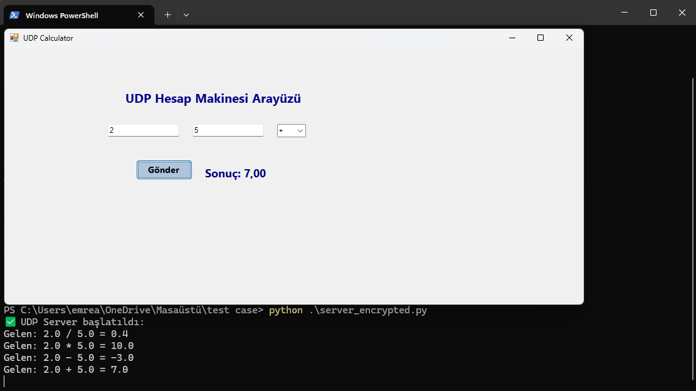

# ⚙️ UDP Calculator (v1.1.0)

Bu proje, UDP tabanlı istemci–sunucu haberleşmesini kullanarak **iki sayı üzerinde dört temel matematiksel işlem** (+, −, ×, ÷) yapmayı sağlar.  
Arayüz **C# diliyle**, sunucu tarafı ise **Python diliyle** yazılmıştır.

- 🖥️ **C# (Windows Forms)** → kullanıcıdan verileri alır ve UDP paketi olarak gönderir  
- 🧠 **Python (server.py)** → gelen verileri işleyip sonucu geri gönderir  
- 🔐 **v1.1.0 sürümünde** → Python kodu Base64 ile şifrelenmiştir (`server_encrypted.py`)

---

## 🚀 Özellikler
- UDP üzerinden çift yönlü veri iletişimi  
- C# GUI üzerinden kolay kullanım  
- 9 byte’lık sabit paket yapısı  
- Gömülü sistemlerde (ör. Raspberry Pi, STM32) test edilebilir  
- Base64 şifreleme ile güvenli sürüm desteği  

---

## 📁 Dosya Yapısı
Aşağıda projede yer alan dosyalar listelenmiştir 👇  

UDP
│

├── UdpCalculator/ # 💻 C# GUI projesi (Visual Studio)

│ ├── Form1.cs # Arayüz işlemleri

│ ├── Form1.Designer.cs # Arayüz tasarımı

│ └── Program.cs # Uygulama başlangıç noktası

│

├── server.py # 🌐 Temel UDP sunucusu (v1.0.0)

├── server_encrypted.py # 🔒 Base64 ile gizli sunucu (v1.1.0)

├── encoded.txt # 🌸 Base64 şifreli Python kodu

├── udp_ui.png # 🖼️ Arayüz ekran görüntüsü

└── README.md # 📘 Proje açıklaması


---

## 🧰 Gereksinimler
- Python 3.8+  
- .NET Framework veya **Visual Studio / VS Code**  
- Aynı ağda çalışan iki cihaz *(ya da localhost testi)*  

---

## 🧩 Çalışma Mantığı
1️⃣ C# arayüzü, kullanıcıdan iki sayıyı (`a`, `b`) ve işlem türünü alır.  
2️⃣ Veriler, **9 byte’lık UDP paketi** olarak gönderilir:  
 - 4 byte → `float a`  
 - 4 byte → `float b`  
 - 1 byte → `işlem kodu` (0=+, 1=−, 2=×, 3=÷)  
3️⃣ Python sunucusu paketi çözümler, işlemi yapar ve sonucu float olarak geri yollar.  
4️⃣ C# arayüzü sonucu ekranda gösterir.  

---

## 🖼️ Arayüz


**Arayüz Bileşenleri**
| Bileşen | Görev |
|----------|--------|
| 🧮 `txtA` | 1. sayı girişi |
| 🧮 `txtB` | 2. sayı girişi |
| ➗ `cmbOp` | İşlem türü seçimi (+ − × ÷) |
| 🚀 `btnSend` | Hesapla / Gönder butonu |
| 📊 `lblResult` | Sonucun gösterildiği alan |

> 🔹 “Gönder” butonuna tıklandığında, işlem sonucu UDP üzerinden hesaplanıp ekrana yazdırılır.

---

## 🧠 Python Sunucusunu Başlatma

### 💠 Normal sürüm
```bash
python3 server.py
```

### 🔐 Şifrelenmiş sürüm (v1.1.0)
```
python3 server_encrypted.py
```

### ✅ Başarılı başlatma çıktısı:
```
✅ UDP Server başlatıldı:
Gelen: 2.0 + 5.0 = 7.0

```

### 🖥️ C# GUI’yi Çalıştırma

PowerShell veya CMD üzerinden:
```
cd UdpCalculator\UdpCalculator\bin\Debug
.\UdpCalculator.exe
```

### 🌐 IP Ayarları

| Durum                        | Python (server.py)                | C# (Form1.cs)                        |
|------------------------------|-----------------------------------|--------------------------------------|
| **Aynı bilgisayar (localhost)** | `s.bind(("0.0.0.0", 5005))`       | `127.0.0.1`                          |
| **Farklı cihaz (ör. Raspberry Pi)** | `s.bind(("0.0.0.0", 5005))`       | Raspberry’nin IP’si (ör. `192.168.0.25`) |


### 💡 UDP bağlantısı için iki cihazın aynı yerel ağda olması gerekir.
Python tarafı 0.0.0.0 ile tüm arayüzleri dinler.

---

## 🎯 Proje Özeti

Bu proje, UDP protokolünü kullanarak **istemci (C#)** ve **sunucu (Python)** arasında gerçek zamanlı veri aktarımı sağlamaktadır.  
Kullanıcı, C# arayüzü üzerinden iki sayı ve bir işlem türü (+, −, ×, ÷) seçer. Bu bilgiler **UDP paketi** olarak gönderilir,  
**Python sunucusu** işlemi gerçekleştirir ve sonucu yine UDP ile geri yollar.  

Bu sayede, **hızlı – hafif – platformdan bağımsız** bir veri alışverişi gerçekleştirilmiştir.  
Aynı yapı, **gömülü sistemlerde (ör. Raspberry Pi)** veya **endüstriyel IoT haberleşmelerinde** temel model olarak kullanılabilir. 🚀

---


